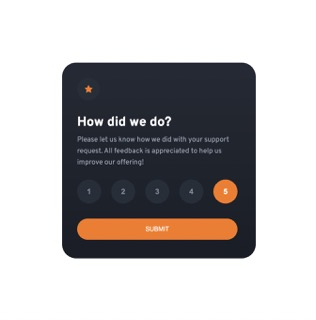
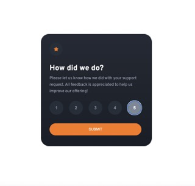
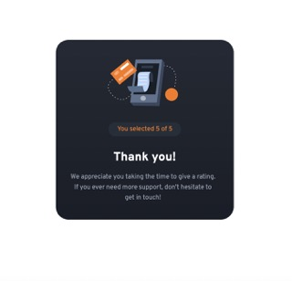

# Frontend Mentor - Interactive rating component solution

This is a solution to the [Interactive rating component challenge on Frontend Mentor](https://www.frontendmentor.io/challenges/interactive-rating-component-koxpeBUmI). Frontend Mentor challenges help you improve your coding skills by building realistic projects. 

## Table of contents

- [Overview](#overview)
  - [The challenge](#the-challenge)
  - [Screenshot](#screenshot)
  - [Links](#links)
- [My process](#my-process)
  - [Built with](#built-with)
  - [What I learned](#what-i-learned)
  - [Continued development](#continued-development)
  - [Useful resources](#useful-resources)
- [Author](#author)

## Overview
This component is a mobile responsive survey/rating application. The numbers highlight as the user hovers over them and then when they select a score of 1-5, the number will remain highlighted after clicking.  The submit button highlights when hovered over as well.  When submit is clicked, if there is no number selected, the app does nothing.  If there is a number selected, it will hide the rating page and display a thank you page.  On the thank you page, it displays the score the user clicked on.

### The challenge

Users should be able to:

- View the optimal layout for the app depending on their device's screen size
- See hover states for all interactive elements on the page
- Select and submit a number rating
- See the "Thank you" card state after submitting a rating

### Screenshot





### Links

- Solution URL: [Add solution URL here](https://github.com/Stacy-Riley/interactive-rating-component)
- Live Site URL: [Add live site URL here](https://stacy-riley.github.io/interactive-rating-component/)

## My process
I began with the mobile version and then the desktop version. After the app was styled, I moved on to JavaScript to apply the functionality to it.

### Built with

- Semantic HTML5 markup
- CSS custom properties
- Flexbox
- Mobile-first workflow


### What I learned
I really learned a lot from this project. When I began, I knew I needed 2 event listeners for the process to work.  One on the submit button and the second on the input buttons that kept the 1-5 score. What I learned though was to apply a class of "selected" to the button so that I could access the value when the submit event listener was activated.  

Also by putting the input buttons inside of a fieldset element, I was able to specify just the input items inside of it and loop through them there.

I like the code below because it applies the class of "selected" to the buttons but before it does that, it removes any older "selected" classes so that there will only be one score/element at a time.

```js
document.querySelectorAll("#fieldset input[type=button]").forEach(button => {
    button.addEventListener("click", function() {
      document.querySelectorAll("#fieldset input[type=button]").forEach(button => {
        //By calling the remove first, we ensure that only one button has the "selected" class at any given time.
        button.classList.remove("selected");
      });
      //Only the clicked button will have the "selected" class.
        button.classList.add("selected");
    });
  });

```

### Continued development

I am committed to honing my skills in accessing and storing user data effectively, in order to provide valuable insights for the site owner and enhance the overall user experience.


### Useful resources

- [Example resource 1](https://developer.mozilla.org/en-US/docs/Web/API/Element/className) - This helped me applying class names to elements by way of JavaScript.
- [Example resource 2](https://developer.mozilla.org/en-US/docs/Web/HTML/Element/fieldset) - This helped me learn more about the form fieldset element.

## Author

- Website - [Stacy Riley](https://www.createdbystacy.com)
- Frontend Mentor - [@Stacy-Riley](https://www.frontendmentor.io/profile/Stacy-Riley)
- Twitter - [@askstacyriley](https://twitter.com/AskStacyRiley)

